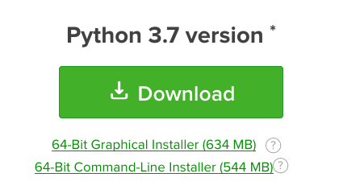

# Setup on your computer

The instructions below are if you have your own laptop, and it has a
reasonable amount of disk space.

If you are borrowing a laptop, or your laptop does not have much space, then
follow [these instructions](slim_setup).

We are going to use a standard data science toolkit to do our analyses.  The
toolkit is the Anaconda Python distribution, which is provides simple
installers that get you nearly all of the common packages you need to get
started using the [Python language](https://www.python.org) for data analysis.
All the packages we will be using are free and open-source; Anaconda is just a
platform that makes it easy to install these packages on your computer.

You will need the "Python 3.7" version of the Anaconda distribution.

* Go to <https://www.anaconda.com/download>
* Choose your operating system (Windows, Mac, Linux):

  

* Choose the Python 3.7 64-bit graphical installer, unless you know you need
  a 32-bit installer.  The details of what you see will vary a little depending
  on your platform - here's what you see for Windows:

  

  Notice that the default download is 64-bit (which is what we want).  Linux
  doesn't have a graphical installer, but if you use Linux, you'll be used to
  that.

* Download the installer you found at the step above.

* Now follow the install instructions for your operating system:

  *   [Install on Windows](https://docs.anaconda.com/anaconda/install/windows)
  *   [Install on Mac](https://docs.anaconda.com/anaconda/install/mac-os#macos-graphical-install)
  *   [Install on Linux](https://docs.anaconda.com/anaconda/install/linux)

  In general, I recommend you choose the defaults at all the prompts.

*   I wouldn't bother subscribing to the free Anaconda cloud account, but hey,
    that's up to you.

Any problems, see the Canvas course page for email address and office hours.
